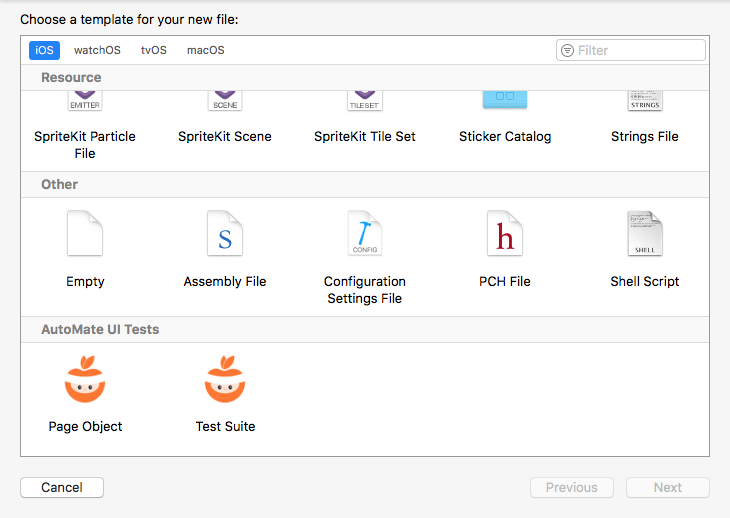

<div align="center">
    
    <br />
    
    <p>
      <a href="https://github.com/PGSSoft/AutoMate">AutoMate</a> &bull;
      <a href="https://github.com/PGSSoft/AutoMate-AppBuddy">AppBuddy</a> &bull;
      <b>Templates</b> &bull;
      <a href="https://github.com/PGSSoft/AutoMate-ModelGenie">ModelGenie</a>
    </p>
</div>

# AutoMate UI Test templates

[`AutoMate`](https://github.com/PGSSoft/AutoMate) is a Swift framework containing a set of helpful `XCTest` extensions for writing UI automation tests. Those Xcode templates helps starting with new UI tests utilizing Page Object pattern and [`AutoMate`](https://github.com/PGSSoft/AutoMate) framework.

[](https://swift.org)
[](https://github.com/PGSSoft/AutoMate-Templates/blob/master/LICENSE)



## Installation

### Installation script

- Clone repository <repo path>

    ```bash
    git clone ...
    ```

- Run installation script placed inside working directory

    ```bash
    ./install.sh
    ```

### Manual

- Clone repository <repo path>

    ```bash
    git clone ...
    ```

- Create `Templates` folder at `/Users/<username>/Library/Developer/Xcode` if doesn't exists

    ```bash
    mkdir -p "${HOME}/Library/Developer/Xcode/Templates"
    ```

- Copy folder `AutoMate UI Tests` from this repository to `/Users/<username>/Library/Developer/Xcode/Templates`. Alternatively make a symbolic link:

    ```bash
    ln -s "/Users/<username>/Library/Developer/Xcode/Templates/AutoMate UI Tests" "/full/path/to/repository/working/copy/AutoMate UI Tests"
    ```

## Features (or ToDo)

- [x] Strong-typed helpers: locators, page object templates
- [x] Base XCTestCase template

## Contributing

Bug reports and pull requests are welcome on GitHub at [https://github.com/PGSSoft/AutoMate-Templates](https://github.com/PGSSoft/AutoMate-Templates).

## License

The project is available as open source under the terms of the [MIT License](http://opensource.org/licenses/MIT).

## About
The project maintained by software development agency [PGS Software](https://www.pgs-soft.com)
See our other [open-source projects](https://github.com/PGSSoft) or [contact us](https://www.pgs-soft.com/contact-us) to develop your product.

## Follow us

[](https://twitter.com/intent/tweet?text=https://github.com/PGSSoft/AutoMate-Templates)  
[](https://twitter.com/pgssoftware)
